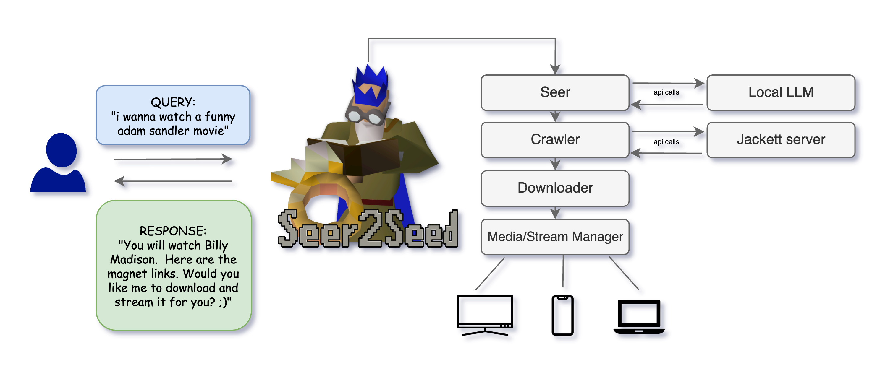

# Seer2Seed




An interface that interprets what a user wants to watch, crawls to find the best torrent, seeds it and streams it back to the user.
- make it a web application? (is this the most universal?)

Connection points:
- LG TV
- mobile
- web browser


MVP:
- cli that can be prompted with a movie (e.g. "Batman Begins")?
- backend that can intelligently retrieve the best torrent for that movie?
- backend that can seed the torrent and provide the file as a download?


docs: https://libtorrent.org/python_binding.html
magnet link example:
- Introduction to Computer Neworks: magnet:?xt=urn:btih:958e2487d2db5f41f9c056bb35cf547edf38528f

Requirements:
- UI 
- backend


### Running the app

### Downloading
```bash
python download.py
```

### Seer
#### Basic usage with default movie "Batman Begins"
```bash
python seer.py
```

#### Specify a different movie
```bash
python seer.py "Inception"
```

#### With debug logging
```bash
python seer.py "The Matrix" --debug
```

#### Specify a different model or API endpoint
```bash
python seer.py "Interstellar" --model "different-model-name" --base-url "http://your-api-endpoint" --api-key "your-api-key"
```

### Testing
The project includes automated tests to verify the torrent downloading functionality.

#### Running Tests

### Test Types

#### Download Tests

- **Mock Tests**: Fast tests that use mocked objects to simulate downloading
  ```bash
  pytest -m "download and unit"
  ```

- **Real Network Tests**: Tests that connect to the BitTorrent network and download actual metadata
  ```bash
  pytest -m "download and real"
  ```

#### Seer Tests

- **Unit Tests**: Tests for the movie information retrieval functionality
  ```bash
  pytest -m "seer and unit"
  ```

- **Integration Tests**: Tests for the end-to-end movie information retrieval
  ```bash
  pytest -m "seer and integration"
  ```

### Test Options

- Run tests with detailed output:
  ```bash
  pytest -v
  ```

- Run a specific test file:
  ```bash
  pytest tests/test_download.py
  pytest tests/test_seer.py
  ```